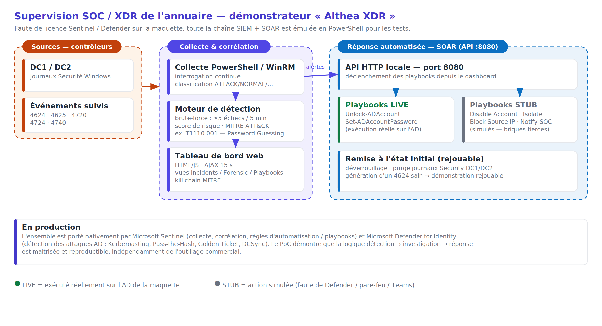

# Althea XDR — Démonstrateur SOC / SOAR (PowerShell)

Démonstrateur de supervision de l'annuaire **Active Directory** développé dans le cadre du projet d'études Bachelor 3 CPI Systèmes, Réseaux & Cloud (Sup de Vinci, 2025-2026) — équipe **Nexobyte**, client fictif **Althea Systems**.

Auteur : **Erwan GUEGANIC** — Étudiant 3 (périmètre Active Directory / Messagerie / Fichiers / VDI + supervision SOC/XDR).

---

> ### ⚠️ Nature du livrable : preuve de concept pédagogique
>
> Ce dépôt contient un **démonstrateur** qui émule en PowerShell la chaîne **SIEM + SOAR** (collecte, corrélation, tableau de bord, playbooks de réponse). Il a été développé **faute de licence Microsoft Sentinel / Defender for Identity** sur l'environnement de maquette.
>
> La **cible de production** documentée dans le DAT (§ 4.9.2) reste **Microsoft Sentinel** (SIEM) couplé à **Microsoft Defender for Identity** (détection des attaques AD : Kerberoasting, Pass-the-Hash, Golden Ticket, DCSync).
>
> Ce code **prouve la logique** détection → investigation → réponse de façon autonome et reproductible ; il **n'est pas destiné à un usage en production**.

---

## Sommaire

1. [Contexte et objectif](#1-contexte-et-objectif)
2. [Ce qui est conçu vs ce qui est prouvé](#2-ce-qui-est-conçu-vs-ce-qui-est-prouvé)
3. [Architecture du démonstrateur](#3-architecture-du-démonstrateur)
4. [Fonctionnalités détaillées](#4-fonctionnalités-détaillées)
5. [Prérequis](#5-prérequis)
6. [Installation et lancement](#6-installation-et-lancement)
7. [Paramètres du script](#7-paramètres-du-script)
8. [Utilisation du tableau de bord](#8-utilisation-du-tableau-de-bord)
9. [Playbooks de réponse (SOAR)](#9-playbooks-de-réponse-soar)
10. [Dérouler la démonstration](#10-dérouler-la-démonstration)
11. [Remise à l'état initial](#11-remise-à-létat-initial)
12. [Bascule FSMO](#12-bascule-fsmo)
13. [Dépannage](#13-dépannage)
14. [Sécurité et confidentialité](#14-sécurité-et-confidentialité)
15. [Arborescence du dépôt](#15-arborescence-du-dépôt)
16. [Lien avec le DAT](#16-lien-avec-le-dat)

---

## 1. Contexte et objectif

Le cahier des charges d'Althea Systems exige que l'Active Directory fasse l'objet d'une **surveillance renforcée** : l'annuaire est la cible privilégiée des attaques, la majorité des compromissions passant par l'exploitation de comptes utilisateurs ou administrateurs.

Pour répondre à cette exigence sur l'environnement de maquette (2 contrôleurs de domaine Hyper-V — DC1 et DC2 — du domaine `altheasystems.local`), ce démonstrateur prouve **de bout en bout** la chaîne :

```
Collecte  ->  Classification  ->  Détection / Corrélation  ->  Investigation  ->  Réponse automatisée
```

Concrètement, il interroge en continu les journaux de sécurité Windows des deux DC, classe chaque événement, détecte une attaque par force brute (essais de mots de passe répétés), affiche le tout dans un tableau de bord web façon SOC, et permet de déclencher des actions de remédiation (déverrouillage, réinitialisation de mot de passe, isolation…) depuis l'interface via une API.

## 2. Ce qui est conçu vs ce qui est prouvé

Cette distinction est volontairement explicite, car elle conditionne la lecture du projet.

| | **Conçu** (documenté dans le DAT) | **Prouvé** (cette maquette) |
|---|---|---|
| **Supervision AD** | Microsoft Sentinel + Defender for Identity | Démonstrateur PowerShell « Althea XDR » |
| **Contrôleurs de domaine** | 3 DC (2 Azure + 1 on-prem), répartition FSMO dédiée | 2 DC Hyper-V (DC1, DC2) |
| **Détection** | Règles analytiques Sentinel + ML Defender | Moteur de corrélation PowerShell (seuil + fenêtre glissante) |
| **Réponse** | Playbooks Logic Apps / automation Sentinel | API SOAR locale + playbooks LIVE et STUB |

Le démonstrateur ne remplace pas la cible de production : il **matérialise la logique** qui sera, en production, portée par les outils Microsoft. C'est cette logique (et sa maîtrise) qui est démontrée, indépendamment de l'outillage commercial.

## 3. Architecture du démonstrateur



*Figure — Architecture du démonstrateur SOC/SOAR « Althea XDR » (reprise de la Figure 12 du DAT).*

Le script est un **monolithe PowerShell autonome** organisé en six blocs logiques :

| Bloc | Rôle |
|---|---|
| **1. Collecte** | `Get-WinEvent` (local + distant via WinRM) sur le journal `Security` des DC |
| **2. Classification** | Normalisation de chaque événement et catégorisation `NORMAL` / `ATTACK` / `ADMIN` / `SYSTEM` |
| **3. Détection / Corrélation** | Agrégation des échecs par compte sur fenêtre glissante, levée d'incidents, construction de la kill chain MITRE |
| **4. Playbooks SOAR** | Actions de réponse `LIVE` (réelles sur l'AD) et `STUB` (simulées) |
| **5. Interface web** | Page HTML/JS unique (3 vues, rafraîchissement AJAX, chat SOC) embarquée dans le script |
| **6. Serveur HTTP + API** | `HttpListener` .NET servant le dashboard et exposant l'API SOAR sur le port 8080 |

Aucune dépendance externe n'est nécessaire : tout (interface comprise) est contenu dans `src/AltheaXDR.ps1`.

## 4. Fonctionnalités détaillées

**Collecte multi-DC.** Interrogation en continu des journaux `Security` de DC1 et DC2. Le DC local est lu directement, le DC distant via WinRM (`Get-WinEvent -ComputerName`). Une fenêtre de rétrospective (par défaut 120 min) borne le volume collecté.

**Événements surveillés.** Les cinq identifiants les plus significatifs pour la sécurité de l'annuaire :

| Event ID | Signification | Catégorie par défaut |
|---|---|---|
| 4624 | Ouverture de session réussie | NORMAL (ou SYSTEM si compte machine) |
| 4625 | Échec d'authentification | ATTACK |
| 4720 | Création de compte utilisateur | ADMIN |
| 4724 | Réinitialisation de mot de passe | ADMIN |
| 4740 | Verrouillage de compte | ATTACK |

**Moteur de détection (MITRE ATT&CK T1110.001 — Password Guessing).** Le cœur de la logique agrège les événements 4625 par compte cible sur une fenêtre glissante (5 min par défaut) ; au-delà du seuil (5 échecs par défaut), un incident `BRUTE-FORCE` de sévérité **HIGH** est levé. Si une ouverture de session **réussie** (4624) survient sur le même compte dans la fenêtre, le démonstrateur lève en plus un incident `COMPROMISSION SUSPECTÉE` de sévérité **CRITICAL** (corrélation T1110.001 -> T1078). Les verrouillages (4740) génèrent un incident `VERROUILLAGE COMPTE` (MEDIUM).

**Tableau de bord web (3 vues).**
- **Incidents** — KPIs temps réel (événements collectés, événements ATTACK, comptes verrouillés, connexions réussies, incidents actifs), table des incidents avec sévérité / technique / compte / sources, et état des contrôleurs de domaine.
- **Forensic** — kill chain MITRE ATT&CK (6 étapes, de la reconnaissance à l'impact), arbre des sources de logs par DC et par Event ID, distribution des sources offensives, et feed classifié des derniers événements.
- **Playbooks** — cartes d'action SOAR et journal des actions exécutées.

**Chat SOC Team.** Un panneau latéral simule l'équipe SOC : le bot `XDR-Bot` pousse automatiquement une alerte et une recommandation à chaque nouvel incident, et répond aux messages de l'analyste.

**API SOAR locale (port 8080).** Trois routes : `GET /api/state` (état complet en JSON, rafraîchi automatiquement), `POST /api/playbook` (déclenchement d'un playbook), `POST /api/chat` (message à l'équipe SOC).

**Rafraîchissement non destructif.** Le dashboard se met à jour toutes les 15 s en AJAX **sans recharger la page** et **sans fermer une fenêtre d'incident ouverte** — confort indispensable pour une démonstration en direct.

## 5. Prérequis

- **Windows Server 2022+** avec le rôle AD DS (maquette : DC1 et DC2)
- **PowerShell 5.1+**
- Module **`ActiveDirectory`** (RSAT) — requis pour les playbooks LIVE
- **WinRM** activé entre la machine d'exécution et le DC distant (pour la collecte multi-DC et le reset)
- Un compte disposant des **droits de lecture du journal Security** et de **gestion des comptes AD**
- **Port 8080** disponible en local
- Console **élevée** (administrateur) — nécessaire pour ouvrir le port HTTP et exécuter les actions AD

## 6. Installation et lancement

```powershell
# 1. Cloner le dépôt sur le serveur de supervision (DC1 en maquette)
git clone https://github.com/Rwano93/nexobyte-althea-xdr.git
cd nexobyte-althea-xdr

# 2. Autoriser l'exécution du script pour la session courante (si nécessaire)
Set-ExecutionPolicy -Scope Process -ExecutionPolicy Bypass

# 3. Lancer le démonstrateur dans une console PowerShell ÉLEVÉE
.\src\AltheaXDR.ps1

# 4. Ouvrir le tableau de bord dans un navigateur
#    http://localhost:8080
```

Pour arrêter le démonstrateur : `Ctrl + C` dans la console.

## 7. Paramètres du script

`src/AltheaXDR.ps1` accepte les paramètres suivants (valeurs par défaut entre parenthèses) :

| Paramètre | Défaut | Description |
|---|---|---|
| `-Port` | `8080` | Port d'écoute du dashboard et de l'API SOAR |
| `-DomainControllers` | `DC1, DC2` | Liste des contrôleurs de domaine à superviser |
| `-PrimaryDC` | `DC1` | DC sur lequel les playbooks LIVE sont exécutés (`-Server`) |
| `-RefreshSeconds` | `15` | Intervalle de rafraîchissement / re-collecte |
| `-WindowMinutes` | `5` | Largeur de la fenêtre glissante de détection |
| `-Threshold` | `5` | Nombre d'échecs 4625 déclenchant un incident brute-force |
| `-LookbackMinutes` | `120` | Profondeur de rétrospective lors de la collecte |
| `-MaxEventsPerDC` | `400` | Plafond d'événements remontés par DC et par cycle |

Exemple — démonstration plus sensible (seuil 3 échecs sur 2 minutes) :

```powershell
.\src\AltheaXDR.ps1 -Threshold 3 -WindowMinutes 2
```

## 8. Utilisation du tableau de bord

1. **Barre supérieure** — bascule entre les vues `INCIDENTS`, `FORENSIC`, `PLAYBOOKS` ; horloge UTC et cadence de rafraîchissement.
2. **Vue Incidents** — surveiller les KPIs et la table des incidents. Un clic sur **RÉPONDRE** ouvre une fenêtre proposant tous les playbooks pour le compte concerné.
3. **Vue Forensic** — analyser la kill chain, identifier les sources offensives, parcourir le feed classifié.
4. **Vue Playbooks** — exécuter une action en saisissant le compte ou l'IP cible ; le journal des actions trace chaque exécution (heure, action, cible, mode LIVE/STUB, résultat).
5. **Chat SOC** — échanger avec le bot ; chaque nouvel incident y déclenche automatiquement une alerte et une recommandation.

## 9. Playbooks de réponse (SOAR)

| Playbook | Mode | Effet |
|---|---|---|
| **Unlock-ADAccount** | **LIVE** | Déverrouille réellement le compte sur le DC primaire |
| **Set-ADAccountPassword** | **LIVE** | Réinitialise le mot de passe (génère un mot de passe robuste, produit l'event 4724) |
| **Disable Account** | STUB | Simulé — production : `Disable-ADAccount` + révocation des sessions Entra ID |
| **Isolate Host** | STUB | Simulé — production : isolation réseau via Defender for Endpoint |
| **Block Source IP** | STUB | Simulé — production : règle de blocage pare-feu Palo Alto / NSG Azure |
| **Notify SOC** | STUB | Simulé — production : webhook Teams + mail astreinte |

Les playbooks **LIVE** agissent sur l'annuaire de la maquette ; les **STUB** matérialisent les actions qui, en production, mobiliseraient des briques tierces (Defender, pare-feu, Teams) non disponibles sur la maquette. Une exécution LIVE marque automatiquement l'incident correspondant comme `CONTAINED`.

## 10. Dérouler la démonstration

Scénario type pour l'oral, à exécuter sur la maquette :

```powershell
# 1. (sur DC1, console élevée) Lancer le démonstrateur
.\src\AltheaXDR.ps1
#    Ouvrir http://localhost:8080  ->  état sain, aucun incident.

# 2. (depuis un poste/DC) Simuler une attaque par force brute :
#    plusieurs tentatives de connexion échouées sur un compte cible.
#    L'objectif est de produire >= 5 événements 4625 sur le même compte
#    en moins de 5 minutes (ex. tentatives RDP/SMB/WinRM avec un mauvais
#    mot de passe sur le compte de test "j.dupont").

# 3. Au bout d'environ 15 s, le dashboard lève un incident BRUTE-FORCE (HIGH),
#    le bot SOC pousse une alerte, la kill chain s'allume sur Credential Access.

# 4. Cliquer RÉPONDRE -> Set-ADAccountPassword (LIVE) puis Unlock-ADAccount (LIVE).
#    L'incident passe CONTAINED, l'event 4724 apparaît dans le feed Forensic.

# 5. Conclure avec le journal des actions SOAR (vue Playbooks) :
#    toute la chaîne détection -> réponse est tracée.
```

> Adapte la méthode de génération des 4625 à ta maquette (compte de test, protocole). L'essentiel est de produire au moins 5 échecs d'authentification sur un même compte dans la fenêtre de 5 minutes.

## 11. Remise à l'état initial

Entre deux passages de démonstration, `scripts/Reset-Demo.ps1` réinitialise la maquette :

```powershell
.\scripts\Reset-Demo.ps1
# ou sans confirmation interactive :
.\scripts\Reset-Demo.ps1 -Force
```

Le script enchaîne quatre étapes :
1. Déverrouille tous les comptes verrouillés (`Search-ADAccount -LockedOut | Unlock-ADAccount`)
2. Purge le journal `Security` du DC local (`wevtutil cl Security`)
3. Purge le journal `Security` du DC distant via `Invoke-Command`
4. Génère un événement 4624 propre pour repartir d'un état sain et vérifiable

Paramètres : `-PrimaryDC` (défaut `DC1`), `-RemoteDC` (défaut `DC2`), `-Force` (saute la confirmation).

## 12. Bascule FSMO

La procédure de démonstration de la résilience de l'annuaire (transfert des rôles FSMO de DC1 vers DC2, vérification, rollback) est documentée dans **[`docs/fsmo-bascule.md`](docs/fsmo-bascule.md)**.

Commande principale (transfert propre, les deux DC en ligne) :

```powershell
Move-ADDirectoryServerOperationMasterRole -Identity "DC2" `
    -OperationMasterRole SchemaMaster, DomainNamingMaster, PDCEmulator, RIDMaster, InfrastructureMaster `
    -Confirm:$false
```

Vérification : `netdom query fsmo`.

> **Note technique.** Les modifications AD pendant la démonstration sont effectuées en PowerShell avec `-Server "DC1"` explicite : sur Windows Server 2022 Azure Edition, les modifications via la console `dsa.msc` ne génèrent pas l'événement 4738, ce qui fausserait la collecte du démonstrateur.

## 13. Dépannage

| Symptôme | Cause probable | Solution |
|---|---|---|
| `Impossible d'écouter sur http://+:8080` | Console non élevée | Relancer PowerShell **en administrateur** (repli automatique sur `localhost` sinon) |
| `… cannot be loaded because running scripts is disabled` | ExecutionPolicy restrictive | `Set-ExecutionPolicy -Scope Process -ExecutionPolicy Bypass` |
| DC distant `INJOIGNABLE` dans le dashboard | WinRM non configuré | `Enable-PSRemoting -Force` sur le DC distant ; vérifier `Test-WSMan DC2` |
| `Module ActiveDirectory absent` | RSAT non installé | `Add-WindowsFeature RSAT-AD-PowerShell` (sur un DC il est déjà présent) |
| Aucun événement collecté | Journaux vidés (après reset) ou audit désactivé | Vérifier la stratégie d'audit ; rejouer le scénario d'attaque |
| Les playbooks LIVE échouent | Droits insuffisants sur l'AD | Exécuter avec un compte habilité à gérer les comptes |

## 14. Sécurité et confidentialité

- **Aucun secret en clair** dans ce dépôt : pas de mot de passe, de jeton ni d'information d'infrastructure réelle.
- Les noms utilisés (domaine `altheasystems.local`, comptes, machines) appartiennent à l'**environnement de maquette** du client **fictif** Althea Systems.
- Les playbooks LIVE n'agissent que sur l'AD de cette maquette et requièrent une authentification explicite de l'opérateur.
- Le mot de passe généré par `Set-ADAccountPassword` est affiché une seule fois dans l'interface, à transmettre par un canal sûr (logique de démonstration).

## 15. Arborescence du dépôt

```
nexobyte-althea-xdr/
├── README.md                  # Ce document
├── src/
│   └── AltheaXDR.ps1          # Démonstrateur complet (collecte + détection + dashboard + API SOAR)
├── scripts/
│   └── Reset-Demo.ps1         # Remise à l'état initial de la démonstration
└── docs/
    ├── architecture.png       # Schéma d'architecture du démonstrateur (Figure 12 du DAT)
    └── fsmo-bascule.md        # Commandes de bascule FSMO (Move-ADDirectoryServerOperationMasterRole)
```

## 16. Lien avec le DAT

Ce dépôt accompagne le **Document d'Architecture Technique — périmètre Étudiant 3 (AD / Messagerie / Fichiers / VDI)** :

- **§ 4.9.2** — Surveillance et journalisation : cible de production (Microsoft Sentinel + Defender for Identity).
- **§ 4.9.3** — Supervision opérationnelle de l'annuaire : architecture et rôle du démonstrateur « Althea XDR ».
- **§ 16.4** — Extrait commenté du cœur de la logique de détection (corrélation des 4625, technique MITRE T1110.001).

---

*Projet d'études Bachelor 3 CPI Systèmes, Réseaux & Cloud — Sup de Vinci, 2025-2026.*
*Équipe Nexobyte · Erwan GUEGANIC (Étudiant 3).*
